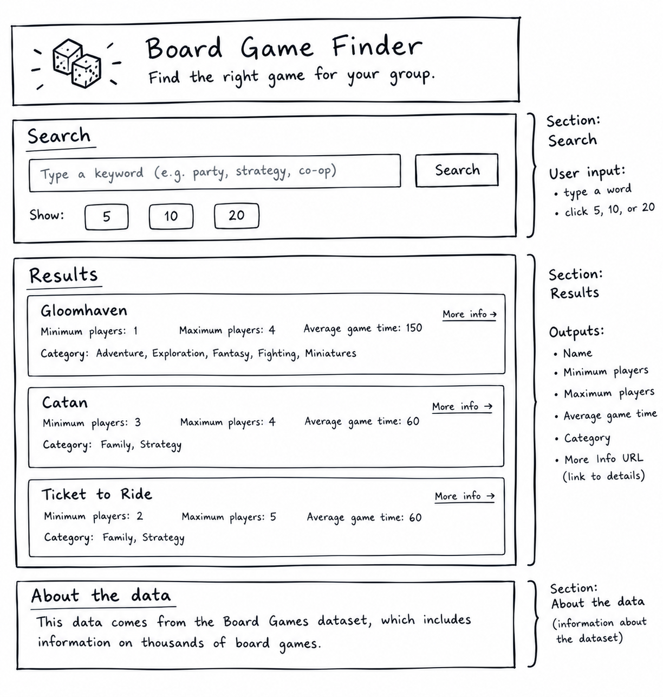

## The Problem

A host with six people coming over needs a game the whole group can play because half the shelf tops out at four.  My page will let you type a word and show the matching games with the details that decide it.  

## The plan

### Sections

- **Search** — the box where a visitor types a word to search for board games.
- **Results** — the matching games and the details that help decide if they work for the group.
- **About the data** — information about the Board Games dataset and where the game information comes from.

### User input

- A visitor types a word to look for and the page shows the matching board games.
- A visitor clicks 5, 10, or 20 and the page shows that many games.

### Outputs

Each result shows `Name`, `Minimum players`, `Maximum players`, and `Average game time`.

# Board Games Dataset

Dataset: Board Games

## Field Inventory

Name: Gloomhaven
Minimum players: 1
Maximum players: 4
Average game time: 150
Year released: 2017

Mechanics: Action/ Movement Programming, Co-operative Play, Grid Movement, Modular Board, Role Playing, Simultaneous Action Selection, Storytelling, Variable Player Powers
Category: Adventure, Exploraton, Fantasy, Fighting, Miniatures
Designer: Isaac Childres
More Info URL: https://boardgamegeek.com/boardgame/174430/gloomhaven

## Three Questions

1. Which board games can be played by only one player?
2. Which board games have an average game time of 60 minutes or less?
3: Which board games were released in 2015 or later?

## Accountability Partner
GitHub: jenna-aurora 

## Links

- Live: https://TammyAlbinDev.github.io/capstone/
- Repo: https://github.com/TammyAlbinDev/capstone
